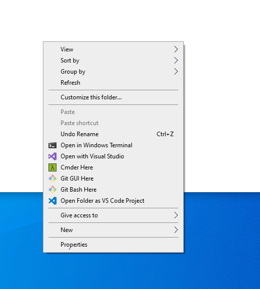
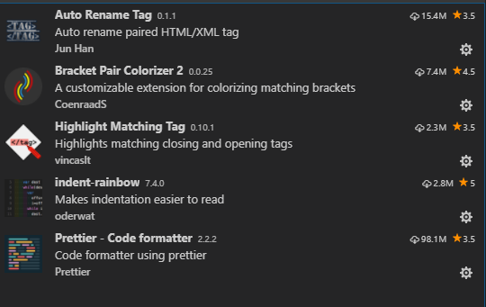

# Environment-Settings

## Windows terminal

Installation and configuration come from
[MS docs](https://docs.microsoft.com/en-us/windows/terminal/tutorials/powerline-setup)

Setting file is present.

## Cmder

Install from [Official web-site](https://cmder.net/) and add it to windows terminal with [medium guide](https://medium.com/talpor/windows-terminal-cmder-%EF%B8%8F-573e6890d143)

One way to make Cmder prettier is to use [PowerLine prompt](https://github.com/powerline/powerline) to do this use [Tahoe Ninjas guid](https://tahoeninjas.blog/2018/05/27/changing-your-command-prompt-to-display-node-module-and-git-information-like-the-sharepoint-conference-presenters/).

:exclamation: did not achived this

This guid will also add a shorthand to windows's context menu.



## VS Code

Extension that I se for JS development



Add VS code to windows context menu:
Can be added at installation fase


Or by .reg script, the location of vs code can found by [VS code docs](https://code.visualstudio.com/docs/setup/windows#:~:text=By%20default%2C%20VS%20Code%20is,%5CPrograms%5CMicrosoft%20VS%20Code%20.).
If your path contains cyrilic letters than you should change them in registry edit, cause there will be treated incorrect.

To get list of extensions run command

```sh
code --list-extensions
```

Setting file is present.
